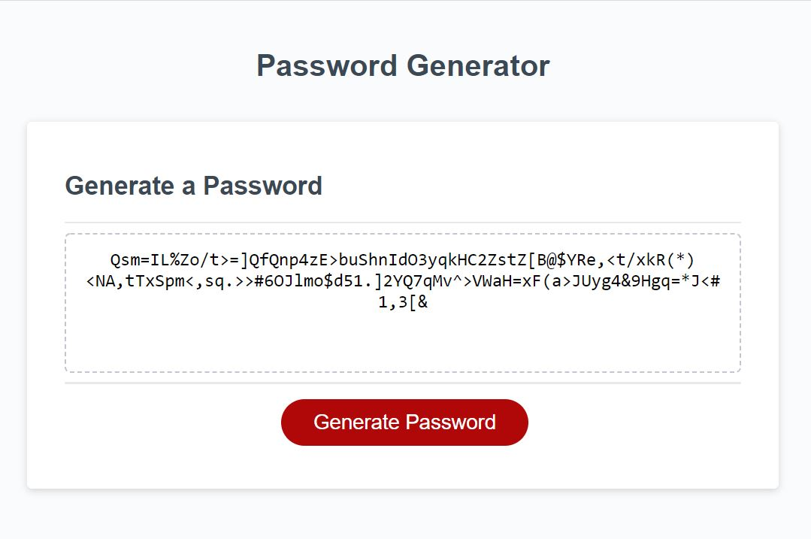

# Password Generator

## Background
For one of our coding bootcamp's challenge assignments, we were tasked with using our JavaScript skills and knowledge of dynamic manipulation of DOM elements to create a functional random password generator.

## Functionality
* When the user clicks the "Generate Password" button, a series of prompts will ask the user:
    * Password Length (between 8 and 128 characters)
    * Whether or not to include lower case letters (abcdefghijklmnopqrstuvwxyz)
    * Whether or not to include upper case letters (ABCDEFGHIJKLMNOPQRSTUVWXYZ)
    * Whether or not to include numbers (1234567890)
    * Whether or not to include symbols (!@#$%^&*(){}[]=<>/,.)

* Once all prompts have been answered, the password is displayed in the text area.

## Live Product

See the live URL of the deployed application here: https://mtlankenau.github.io/password-generator/.